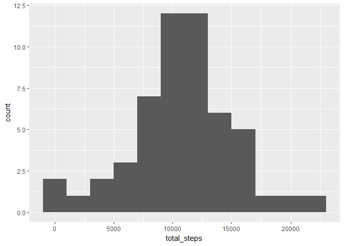
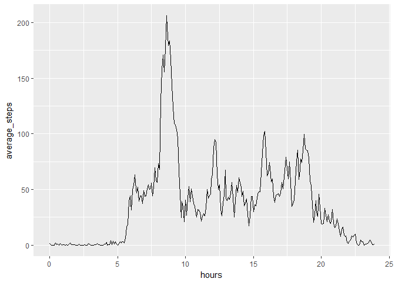
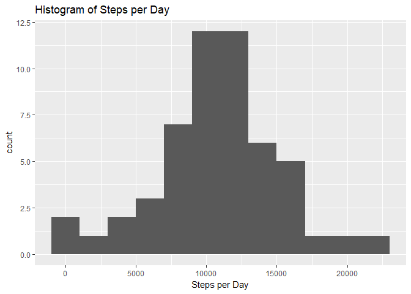

Still need to put text to code. And annotate/beautify the plots.


## Loading and preprocessing the data
First we will load all the packages we will use. Then we will unzip and import the data. The way interval works is strange, so we will introduce some additional variables to keep track of time.


```r
library(magrittr)
library(tidyverse)
```

```
## -- Attaching packages ---------------------------------------------------------------------------------- tidyverse 1.2.1 --
```

```
## v ggplot2 2.2.1     v purrr   0.2.4
## v tibble  1.4.2     v dplyr   0.7.4
## v tidyr   0.8.0     v stringr 1.3.0
## v readr   1.1.1     v forcats 0.3.0
```

```
## -- Conflicts ------------------------------------------------------------------------------------- tidyverse_conflicts() --
## x tidyr::extract()   masks magrittr::extract()
## x dplyr::filter()    masks stats::filter()
## x dplyr::lag()       masks stats::lag()
## x purrr::set_names() masks magrittr::set_names()
```

```r
unzip("activity.zip")
data <- read_csv("activity.csv")
```

```
## Parsed with column specification:
## cols(
##   steps = col_integer(),
##   date = col_date(format = ""),
##   interval = col_integer()
## )
```

```r
data %<>% mutate(hours = floor(interval / 100) + (interval %% 100) / 60) %>%
    print
```

```
## # A tibble: 17,568 x 4
##    steps date       interval  hours
##    <int> <date>        <int>  <dbl>
##  1    NA 2012-10-01        0 0.    
##  2    NA 2012-10-01        5 0.0833
##  3    NA 2012-10-01       10 0.167 
##  4    NA 2012-10-01       15 0.250 
##  5    NA 2012-10-01       20 0.333 
##  6    NA 2012-10-01       25 0.417 
##  7    NA 2012-10-01       30 0.500 
##  8    NA 2012-10-01       35 0.583 
##  9    NA 2012-10-01       40 0.667 
## 10    NA 2012-10-01       45 0.750 
## # ... with 17,558 more rows
```


## What is mean total number of steps taken per day?

```r
data_by_date <- data %>%
    drop_na %>%
    group_by(date) %>%
    summarize(total_steps = sum(steps))

data_by_date %>%
    ggplot(aes(total_steps)) +
    geom_histogram(binwidth = 2000)
```

<!-- -->

```r
mean(data_by_date$total_steps)
```

```
## [1] 10766.19
```

```r
median(data_by_date$total_steps)
```

```
## [1] 10765
```


## What is the average daily activity pattern?
Interval is funky because it's not base 10. E.g. it goes 45, 50, 55, 100.


```r
data_by_hours <- data %>%
    drop_na %>%
    group_by(hours) %>%
    summarize(average_steps = mean(steps))

data_by_hours %>%
    ggplot(aes(x = hours, y = average_steps)) +
    geom_line()
```

<!-- -->

```r
i <- which.max(data_by_hours$average_steps)
data_by_hours$hours[i]
```

```
## [1] 8.583333
```

```r
data$interval[i]
```

```
## [1] 835
```

So the 5-minute interval corresponding to 8:35 to 8:40 AM.

## Imputing missing values

Just use the mean value for the given interval.


```r
sum(!complete.cases(data))
```

```
## [1] 2304
```

```r
imputed_data <- data %>%
    group_by(interval) %>%
    mutate(steps = ifelse(is.na(steps), mean(steps, na.rm = T), steps)) %>%
    ungroup %>%
    print
```

```
## # A tibble: 17,568 x 4
##     steps date       interval  hours
##     <dbl> <date>        <int>  <dbl>
##  1 1.72   2012-10-01        0 0.    
##  2 0.340  2012-10-01        5 0.0833
##  3 0.132  2012-10-01       10 0.167 
##  4 0.151  2012-10-01       15 0.250 
##  5 0.0755 2012-10-01       20 0.333 
##  6 2.09   2012-10-01       25 0.417 
##  7 0.528  2012-10-01       30 0.500 
##  8 0.868  2012-10-01       35 0.583 
##  9 0.     2012-10-01       40 0.667 
## 10 1.47   2012-10-01       45 0.750 
## # ... with 17,558 more rows
```

```r
mean(imputed_data$steps)
```

```
## [1] 37.3826
```

```r
mean(data$steps, na.rm = T)
```

```
## [1] 37.3826
```

```r
data_by_date <- imputed_data %>%
    group_by(date) %>%
    summarize(total_steps = sum(steps))

data_by_date %>%
    ggplot(aes(total_steps)) +
    geom_histogram(binwidth = 2000)
```

<!-- -->

```r
mean(data_by_date$total_steps)
```

```
## [1] 10766.19
```

```r
median(data_by_date$total_steps)
```

```
## [1] 10766.19
```


## Are there differences in activity patterns between weekdays and weekends?

```r
imputed_data %<>%
    mutate(weekend = factor(ifelse(weekdays(date) %in% c("Saturday", "Sunday"), 
                                   "weekend", "weekday"))) %>%
    print
```

```
## # A tibble: 17,568 x 5
##     steps date       interval  hours weekend
##     <dbl> <date>        <int>  <dbl> <fct>  
##  1 1.72   2012-10-01        0 0.     weekday
##  2 0.340  2012-10-01        5 0.0833 weekday
##  3 0.132  2012-10-01       10 0.167  weekday
##  4 0.151  2012-10-01       15 0.250  weekday
##  5 0.0755 2012-10-01       20 0.333  weekday
##  6 2.09   2012-10-01       25 0.417  weekday
##  7 0.528  2012-10-01       30 0.500  weekday
##  8 0.868  2012-10-01       35 0.583  weekday
##  9 0.     2012-10-01       40 0.667  weekday
## 10 1.47   2012-10-01       45 0.750  weekday
## # ... with 17,558 more rows
```

```r
imputed_data %>% group_by(date) %>% print
```

```
## # A tibble: 17,568 x 5
## # Groups:   date [61]
##     steps date       interval  hours weekend
##     <dbl> <date>        <int>  <dbl> <fct>  
##  1 1.72   2012-10-01        0 0.     weekday
##  2 0.340  2012-10-01        5 0.0833 weekday
##  3 0.132  2012-10-01       10 0.167  weekday
##  4 0.151  2012-10-01       15 0.250  weekday
##  5 0.0755 2012-10-01       20 0.333  weekday
##  6 2.09   2012-10-01       25 0.417  weekday
##  7 0.528  2012-10-01       30 0.500  weekday
##  8 0.868  2012-10-01       35 0.583  weekday
##  9 0.     2012-10-01       40 0.667  weekday
## 10 1.47   2012-10-01       45 0.750  weekday
## # ... with 17,558 more rows
```

