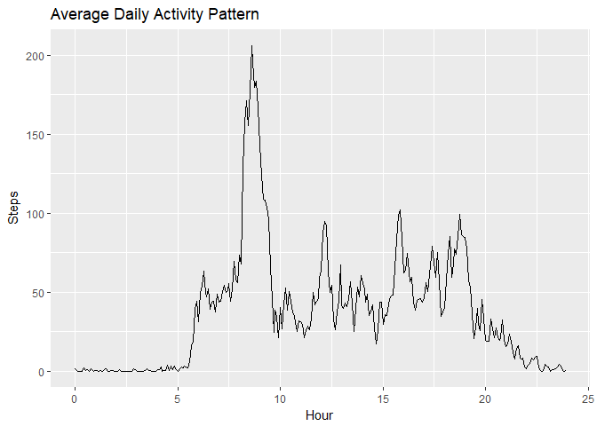
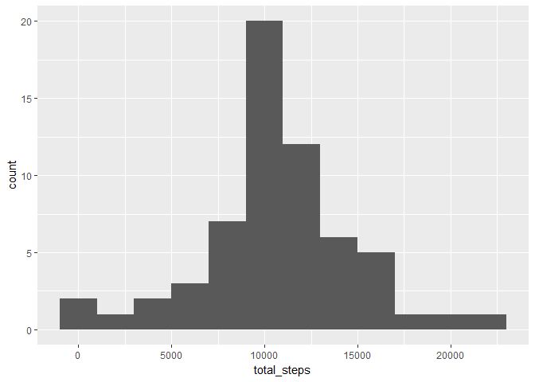
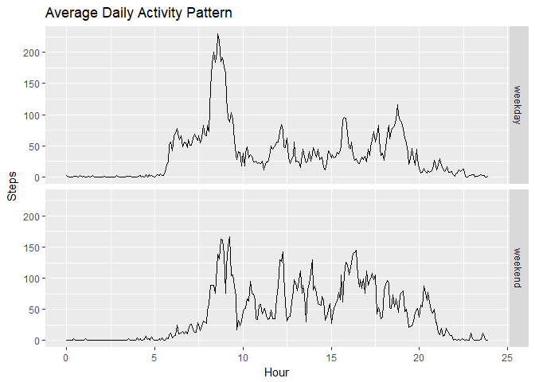

## Loading and preprocessing the data
First we load the the packages we need to perform the later analyses. 


```r
library(magrittr)
library(tidyverse)
```

```
## -- Attaching packages ---------------------------------------------------------------------------------- tidyverse 1.2.1 --
```

```
## v ggplot2 2.2.1     v purrr   0.2.4
## v tibble  1.4.2     v dplyr   0.7.4
## v tidyr   0.8.0     v stringr 1.3.0
## v readr   1.1.1     v forcats 0.3.0
```

```
## -- Conflicts ------------------------------------------------------------------------------------- tidyverse_conflicts() --
## x tidyr::extract()   masks magrittr::extract()
## x dplyr::filter()    masks stats::filter()
## x dplyr::lag()       masks stats::lag()
## x purrr::set_names() masks magrittr::set_names()
```

Next, we unzip the data and import it.


```r
unzip("activity.zip")
data <- read_csv("activity.csv")
```

```
## Parsed with column specification:
## cols(
##   steps = col_integer(),
##   date = col_date(format = ""),
##   interval = col_integer()
## )
```

Now, we perform just a bit of preprocessing, creating an additional variable `hours`. The original `interval` variable works strangely with plotting because because, for example, from 1:55 PM to 2:00 PM the `interval` jumps from 1355 to 1400, creating a gap of 45 that isn't really there. So we create the `hours` variable that just records the time of day in hours from 0 to 24. For example, 1:30 PM becomes 13.5.


```r
data %<>% mutate(hours = floor(interval / 100) + (interval %% 100) / 60) %>%
    print
```

```
## # A tibble: 17,568 x 4
##    steps date       interval  hours
##    <int> <date>        <int>  <dbl>
##  1    NA 2012-10-01        0 0.    
##  2    NA 2012-10-01        5 0.0833
##  3    NA 2012-10-01       10 0.167 
##  4    NA 2012-10-01       15 0.250 
##  5    NA 2012-10-01       20 0.333 
##  6    NA 2012-10-01       25 0.417 
##  7    NA 2012-10-01       30 0.500 
##  8    NA 2012-10-01       35 0.583 
##  9    NA 2012-10-01       40 0.667 
## 10    NA 2012-10-01       45 0.750 
## # ... with 17,558 more rows
```


## What is mean total number of steps taken per day?

Now we investigate the average number of steps taken per day, with incomplete observations removed. Below we have a histogram of the number of steps per day. We also see that the mean and median of the steps per day are 10766.19 and 10765, respectively, corresponding to about the middle of the histogram.


```r
data_by_date <- data %>%
    drop_na %>%
    group_by(date) %>%
    summarize(total_steps = sum(steps))

data_by_date %>%
    ggplot(aes(total_steps)) +
    geom_histogram(binwidth = 2000) +
    ggtitle("Histogram of Steps per Day") +
    xlab("Steps per Day")
```

<!-- -->

```r
mean(data_by_date$total_steps)
```

```
## [1] 10766.19
```

```r
median(data_by_date$total_steps)
```

```
## [1] 10765
```


## What is the average daily activity pattern?

Now we examine the average daily activity pattern by looking at the steps per five minute interval, averaged over all days. Rather than using the `interval` variable, we actually use the `hours` variable for the reason discussed above. Below we have a line plot showing the daily activity pattern. We see little to no activity during sleeping hours, and various fluctuations throughout the day, with a particularly large spike somewhere between 8 AM and 10 AM. The actual maximum occurs in the five minute interval between 8:35 AM and 8:40 AM, as we see from the code below the histogram.


```r
data_by_hours <- data %>%
    drop_na %>%
    group_by(hours) %>%
    summarize(average_steps = mean(steps))

data_by_hours %>%
    ggplot(aes(x = hours, y = average_steps)) +
    geom_line() +
    ggtitle("Average Daily Activity Pattern") +
    xlab("Hour") +
    ylab("Steps")
```

<!-- -->

```r
i <- which.max(data_by_hours$average_steps)
data$interval[i]
```

```
## [1] 835
```

## Imputing missing values

Out of 17568 observations, 2304 are missing the number of steps, as shown below. To impute these missing values, we will use the mean across all days for the given five minute interval. That is, if an observation between, say, 5:45 AM and 5:40 AM is missing the number of steps, we will look at all days where the number of steps is recorded for that five minute interval, take the mean of the number of steps in that interval, and use that value for all days where the number of steps is missing for that interval. 

Below, we recreate the histogram from earlier, but this time with our imputed data. We see that the histogram looks somewhat more concentrated near the mean. This makes sense since we've added extra data that is close to average in some sense. Below the histogram, we see the mean and median again. The mean is unchanged, and the median now equals the mean.


```r
sum(!complete.cases(data))
```

```
## [1] 2304
```

```r
imputed_data <- data %>%
    group_by(interval) %>%
    mutate(steps = ifelse(is.na(steps), mean(steps, na.rm = T), steps)) %>%
    ungroup %>%
    print
```

```
## # A tibble: 17,568 x 4
##     steps date       interval  hours
##     <dbl> <date>        <int>  <dbl>
##  1 1.72   2012-10-01        0 0.    
##  2 0.340  2012-10-01        5 0.0833
##  3 0.132  2012-10-01       10 0.167 
##  4 0.151  2012-10-01       15 0.250 
##  5 0.0755 2012-10-01       20 0.333 
##  6 2.09   2012-10-01       25 0.417 
##  7 0.528  2012-10-01       30 0.500 
##  8 0.868  2012-10-01       35 0.583 
##  9 0.     2012-10-01       40 0.667 
## 10 1.47   2012-10-01       45 0.750 
## # ... with 17,558 more rows
```

```r
data_by_date <- imputed_data %>%
    group_by(date) %>%
    summarize(total_steps = sum(steps))

data_by_date %>%
    ggplot(aes(total_steps)) +
    geom_histogram(binwidth = 2000)
```

<!-- -->

```r
mean(data_by_date$total_steps)
```

```
## [1] 10766.19
```

```r
median(data_by_date$total_steps)
```

```
## [1] 10766.19
```


## Are there differences in activity patterns between weekdays and weekends?

Finally, we will explore potential differences in daily activity patterns between weekdays and weekends. We create a new factor variable `weekend` with two levels `weekend` and `weekday`, corresponding to whether a given observation was taken on a weekday or during the weekend. 

The line graph below shows the daily activity pattern, defined as above, but with separate facets for weekday data and weekend data. Compared to the weekdays, during the weekends we see a later start to activity, as well as a later end. We also see more consistent variation and a higher number of steps throughout the day on weekends. 


```r
imputed_data %<>%
    mutate(weekend = factor(ifelse(weekdays(date) %in% c("Saturday", "Sunday"), 
                                   "weekend", "weekday"))) %>%
    print
```

```
## # A tibble: 17,568 x 5
##     steps date       interval  hours weekend
##     <dbl> <date>        <int>  <dbl> <fct>  
##  1 1.72   2012-10-01        0 0.     weekday
##  2 0.340  2012-10-01        5 0.0833 weekday
##  3 0.132  2012-10-01       10 0.167  weekday
##  4 0.151  2012-10-01       15 0.250  weekday
##  5 0.0755 2012-10-01       20 0.333  weekday
##  6 2.09   2012-10-01       25 0.417  weekday
##  7 0.528  2012-10-01       30 0.500  weekday
##  8 0.868  2012-10-01       35 0.583  weekday
##  9 0.     2012-10-01       40 0.667  weekday
## 10 1.47   2012-10-01       45 0.750  weekday
## # ... with 17,558 more rows
```

```r
imputed_data %>%
    group_by(hours, weekend) %>%
    summarize(average_steps = mean(steps)) %>%
    ggplot(aes(x = hours, y = average_steps)) +
    geom_line() + 
    facet_grid(weekend ~ .) +
    ggtitle("Average Daily Activity Pattern") +
    xlab("Hour") +
    ylab("Steps")
```

<!-- -->

