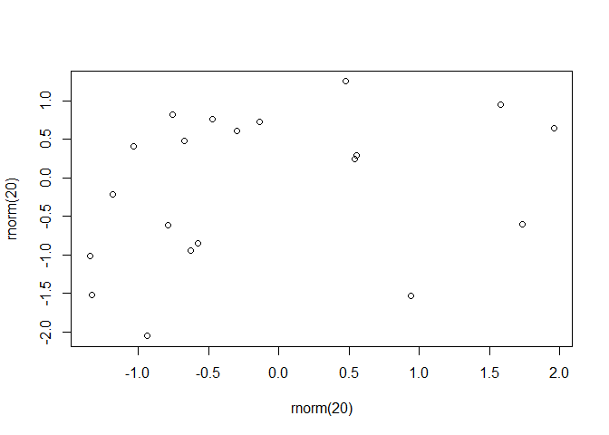

## Loading and preprocessing the data

```r
plot(rnorm(20), rnorm(20))
```

<!-- -->


## What is mean total number of steps taken per day?


## What is the average daily activity pattern?


## Imputing missing values


## Are there differences in activity patterns between weekdays and weekends?
